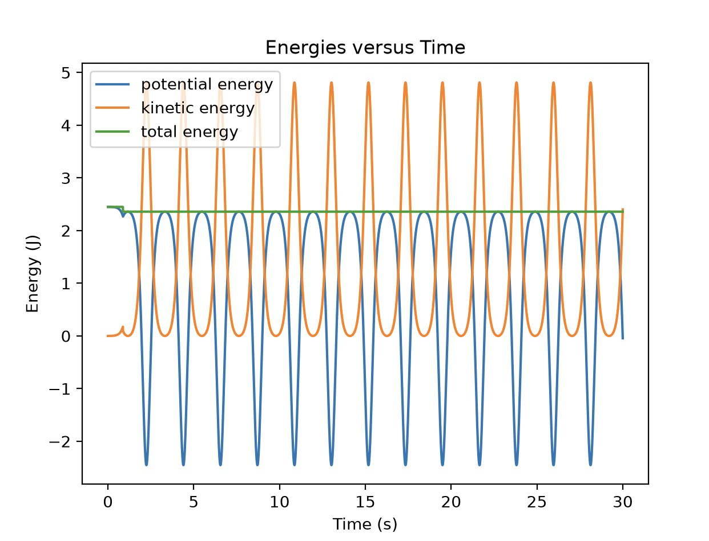
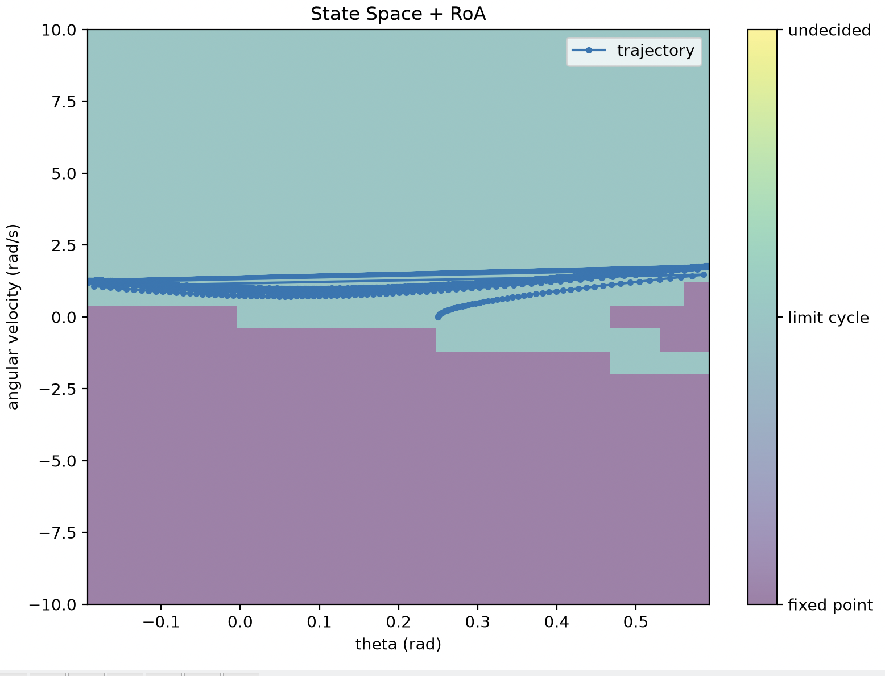
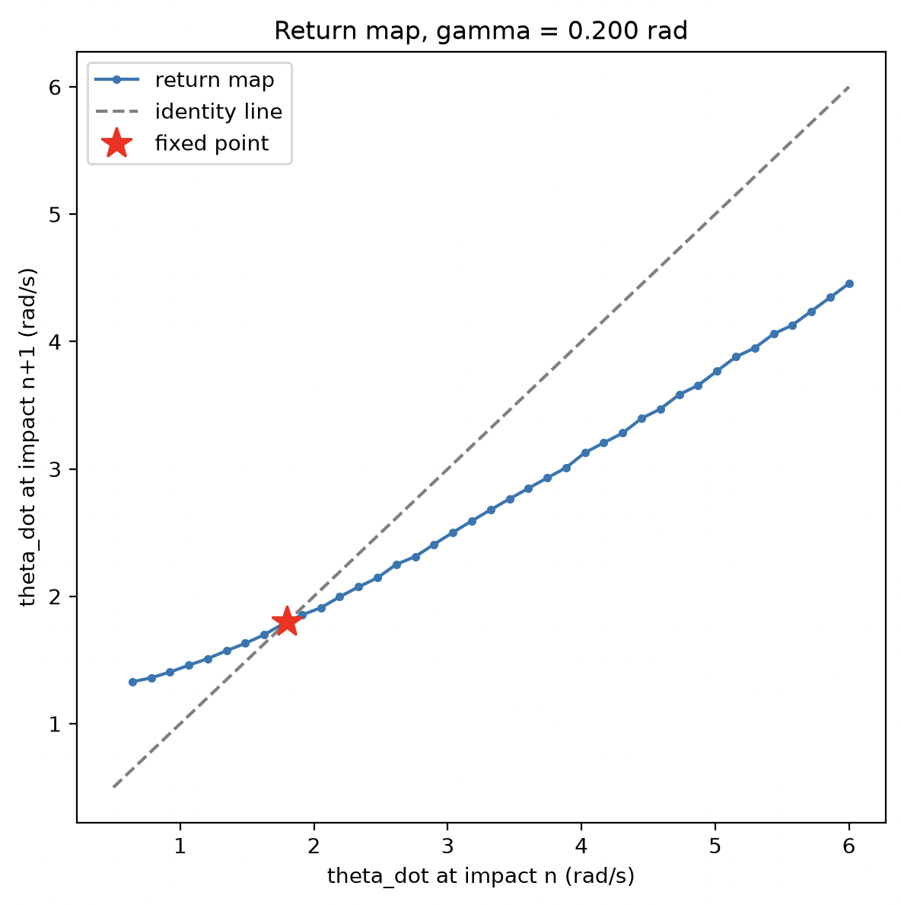
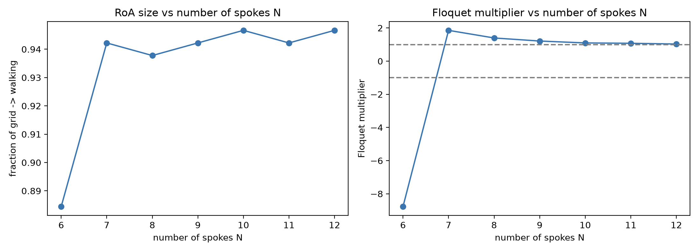
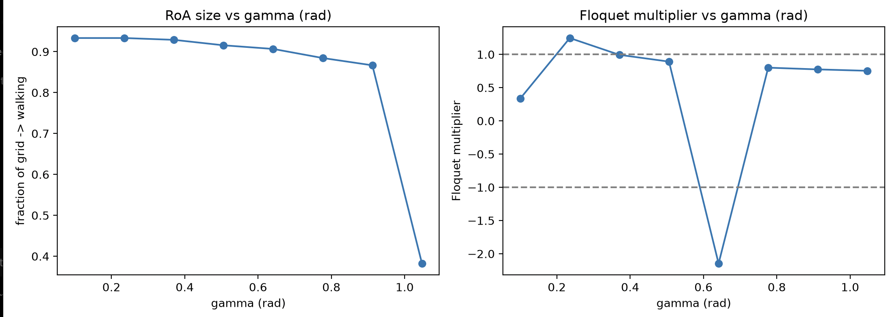

# Assignment 1: Rimless Wheel Stability Analysis

## 1. Parameters used

For the main analysis I used:

| Parameter | Value |
|---|---:|
| Gravity $g$ | 9.81 m/s$^2$ |
| Mass $m$ | 0.25 kg |
| Leg length $L$ | 1 m |
| Damping $b$ | 0 |
| Number of spokes $N$ | 8 |
| Ground inclination $\gamma$ | 0.2 rad |

The timestep used for the simulations was 1e-2 s. The simulation time was set to 60s.

The initial conditions where 0.25 for theta and 0 for theta dot.

---

## 2. Sanity Checks

### 2.1 Zero gravity

The first sanity check was to set the gravity to zero keeping the current parameters. 
With theta dot = 0, we are expecting a flat total energy line and nothing else in the energy plot as nothing would be happening. 

The results confirm that behavior. We can clearly see a flat line.


---

### 2.2 No slope

Second check was to keep all the parameters as initial and changing the slope to 0. 
The expected result is the behavior of a regular pendulum since the slope will not allow the total energy to increase and the wheel to keep rolling forward. We will just oscillate between two spokes.

Running the code did confirm that. If we compare the plot below to the one obtained in assignement 0, we can observe a similar behavior.



---

### 2.3 Theta boundaries and Spoke change behavior

With the set initial parameters, I was then able to look at the State Space plot and RoA map to check two things. First, that the theta boundaries were repected. Those are expected to be between the slope angle +/- half the angle between two spokes. Second, that the spoke change was indeed happening. To check that, I looked at if my trajectory was jumping from one end of the boundary to the other. 

The graph below confirms both those checks. We can see the clear theta bounds as nothing is plotted beyond them, and the trajectory is cleary bouncing from on to the other (the bounce itself beeing "invisible" as it is not actually part of the trajectory).



---

## 3. Region of Attraction


---

## 4. Poincaré Return Map



---

## 5. How the slope and number of spokes affect the RoA and local convergence

The size of the region of attraction significantly increases when the number of spokes is above 6, while the floquet multiplier follows an exponential decrease towards one as the number of spokes increases. This is consistent with the fact that a larger number of spokes reduces the angle between impacts, so each impact dissipates less energy. The larger RoA reflects this increased robustness to initial conditions, though the multiplier approaching one indicates the limit cycle becomes only weakly attracting, with slower convergence toward the periodic gait.

For the gamma sweep, we can observe a jump when the slope becomes more angled than 0.2rad, followed by a linear increase as it gets steeper. The Floquet multiplier seems to be again following an exponential decrease, this time towards 0.5. The threshold suggests a minimum ground inclination below which gravity cannot supply enough energy to sustain a stable periodic gait, so no meaningful limit cycle exists until this bifurcation point is crossed. Beyond the threshold, steeper slopes inject more energy per step, which both widens the RoA and strengthens the contraction rate toward the limit cycle.





---

## 6. How to Run the Code

The main analysis is run from `assignment_1.py`.

From the assignment directory, run:

```bash
python assignment_1.py
```
---

## 7. AI disclosure

I did use AI to figure out how to write some fonctions. I have never coded a lot of those things before and needed help trying to figure out how to do it. 