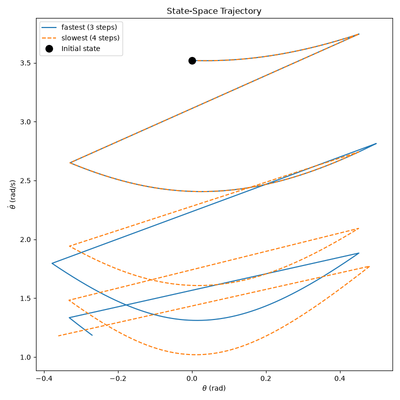

# Assignment 2: Inverted Pendulum Walker

## 1. Parameters used

The parameters used are:

| Parameter | Value |
|---|---:|
| Gravity $g$ | 9.81 m/s$^2$ |
| Mass $m$ | 1.0 kg |
| Leg length $L$ | 1.0 m |
| Angle of attack $\alpha$ | pi/8 ° |
| Angle of torque $\tau$ | 0.0 °|
| Incline $\gamma$ | 0.06 rad |

---

## 2. Schematics

---

## 3. RoA for the ankle controller

---

## 4. Choice of Poincaré section

We choose θ = 0 (the vertical, mid-stance configuration) as the Poincaré section for the step-to-step dynamics, rather than the touchdown event used for the rimless wheel. 

In the rimless wheel, touchdown occurred at a fixed geometric angle set by the spoke spacing, so it was a natural constant-θ surface. Once the angle of attack α becomes a free control input, the touchdown angle itself depends on α (and on the incline γ), so the touchdown surface moves depending on the control chosen at each step. It is no longer a fixed slice of the state space and cannot serve as a section on which θ is constant. 

θ = 0 avoids this problem: it does not depend on α or γ at all, so it remains a fixed, constant θ line in the state space regardless of the control policy. It is also crossed exactly once per stride, with θ̇ > 0 throughout ordinary forward walking, so the flow is transverse to the section (never tangent to it) and the crossing is guaranteed to be well-defined. 

This leaves θ̇ₖ as the single state of the discrete-time return map.

Alternativelly, we could choose the angle perpendicular to the slope since it will always be crossed as well.

---

## 5. Grid resolution verification

We verified the lookup-table grid resolution by comparing the predicted minimum
number of steps to standstill at several initial angular velocities. We tested
velocity-angle grids ranging from 5 x 3 to 80 x 40.

| Resolution (velocity x angle points) | 1.0 | 1.5 | 2.0 | 2.5 | 3.0 | 3.5 | 4.0 |
|---|---:|---:|---:|---:|---:|---:|---:|
| 5 x 3   | inf | inf | inf | inf | inf | inf | inf |
| 10 x 5  | 1 | 2 | 2 | 3 | 3 | 3 | 4 |
| 20 x 10 | 1 | 2 | 2 | 3 | 3 | 3 | 3 |
| 40 x 20 | 1 | 2 | 2 | 2 | 3 | 3 | 3 |
| 80 x 40 | 1 | 2 | 2 | 2 | 3 | 3 | 3 |

The 5 x 3 grid is clearly too coarse because it fails to find a stabilizing
sequence for all of the tested initial velocities. Increasing the resolution
also changes the predicted number of steps. In particular, the 20 x 10 grid
predicts 3 steps from 2.5 rad/s, while the 40 x 20 grid predicts 2 steps.
Doubling the resolution again from 40 x 20 to 80 x 40 produces no change at
any of the seven tested velocities. We therefore use 40 x 20 as the coarsest
grid that satisfies our convergence criterion.

---

## 6. Trajectory comparison (fastest vs slowest policy)

We selected the initial condition theta = 0 rad and theta_dot = 3.52 rad/s
because the fastest stabilizing policy requires at least three steps from this
state.

Using the fastest-stabilizing policy, the walker reaches the ankle controller's
region of attraction in 3 steps. We also searched for a stabilizing sequence
that allows the walker to continue walking for as long as possible before
entering the region of attraction. For the same initial condition, the simulated
trajectory reaches the region of attraction after 4 steps.

The difference between the two trajectories illustrates that the choice of
angle of attack alpha at each Poincare section crossing changes the number of
steps required before the continuous ankle controller can bring the walker to
the standing equilibrium.

---

## 7. Steps to standstill

This plot shows the minimum number of steps required to reach the ankle
controller's region of attraction as a function of the initial angular velocity
on the Poincare section theta = 0. For each state, the controller selects the
angle of attack alpha that leads to a state with the smallest remaining number
of steps. Once the trajectory enters the region of attraction, control is
handed over to the continuous ankle-torque controller to bring the walker to
the standing equilibrium.