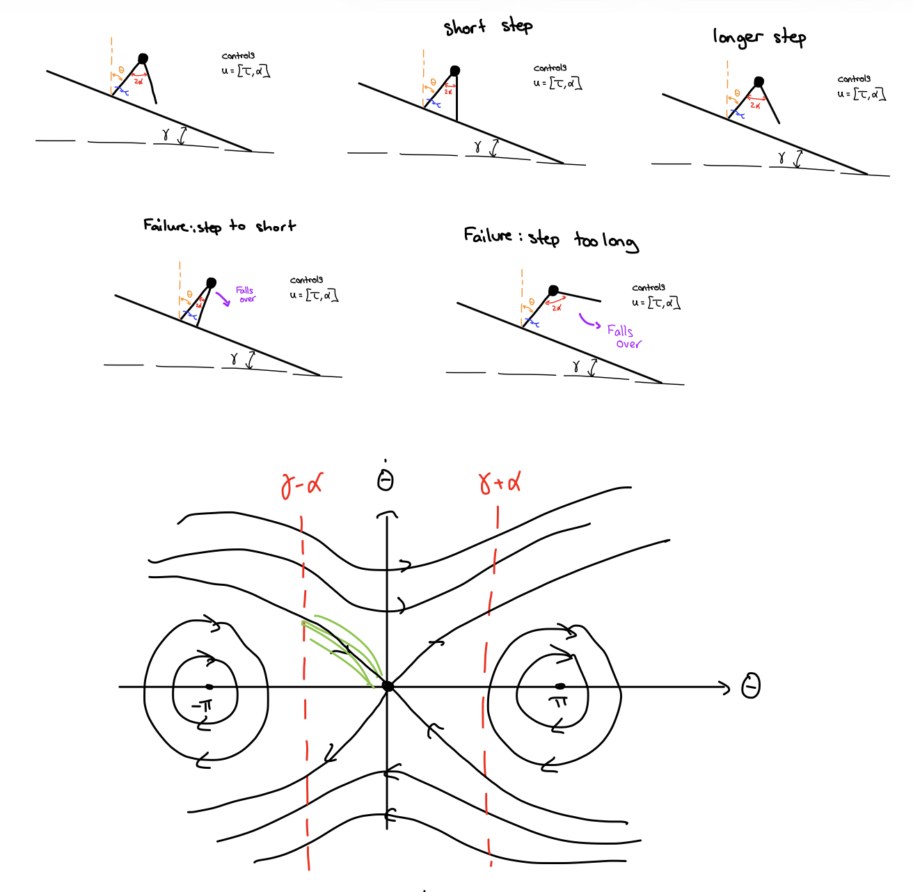
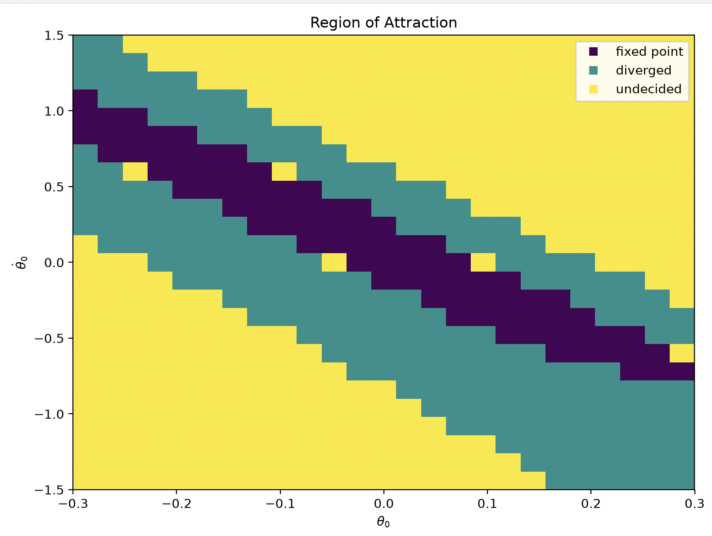
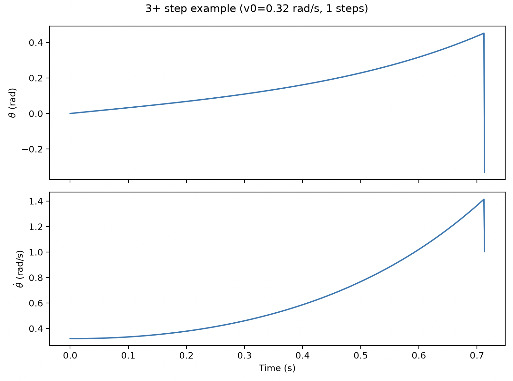
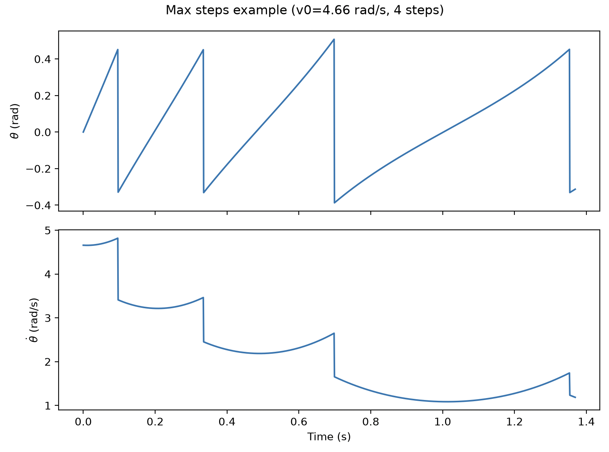
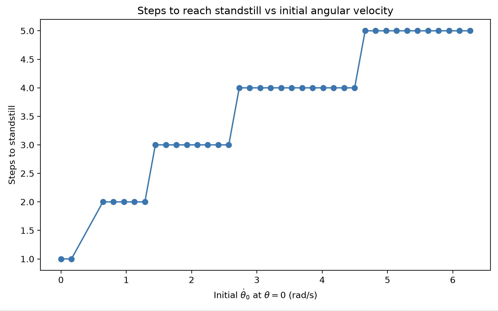

# Assignment 2: Inverted Pendulum Walker

## 1. Parameters used

The parameters used are:

| Parameter | Value |
|---|---:|
| Gravity $g$ | 9.81 m/s$^2$ |
| Mass $m$ | 1.0 kg |
| Leg length $L$ | 1.0 m |
| Angle of attack $\alpha$ | pi/8 ° |
| Angle of torque $\tau$ | 0.0 °|
| Incline $\gamma$ | 0.06 rad |

---

## 2. Schematics

---

## 3. RoA for the ankle controller

---

## 4. Choice of Poincaré section

We choose θ = 0 (the vertical, mid-stance configuration) as the Poincaré section for the step-to-step dynamics, rather than the touchdown event used for the rimless wheel. 

In the rimless wheel, touchdown occurred at a fixed geometric angle set by the spoke spacing, so it was a natural constant-θ surface. Once the angle of attack α becomes a free control input, the touchdown angle itself depends on α (and on the incline γ), so the touchdown surface moves depending on the control chosen at each step. It is no longer a fixed slice of the state space and cannot serve as a section on which θ is constant. 

θ = 0 avoids this problem: it does not depend on α or γ at all, so it remains a fixed, constant θ line in the state space regardless of the control policy. It is also crossed exactly once per stride, with θ̇ > 0 throughout ordinary forward walking, so the flow is transverse to the section (never tangent to it) and the crossing is guaranteed to be well-defined. 

This leaves θ̇ₖ as the single state of the discrete-time return map.

Alternativelly, we could choose the angle perpendicular to the slope since it will always be crossed as well.

---

## 5. Grid resolution verification

We verified grid resolution by building the step-to-step lookup table at several
resolutions and comparing the predicted number of steps to standstill for a fixed
set of test velocities (1.0, 2.0, 3.0 rad/s) not aligned with any grid point.

| Resolution (velocity x angle points) | Steps for v0=1.0 | Steps for v0=2.0 | Steps for v0=3.0 |
|---|---:|---:|---:|
| 10 x 5   | 2.0 | 3.0 | 4.0 |
| 20 x 10  | 3.0 | 4.0 | 4.0 |
| 40 x 20  | 2.0 | 3.0 | 4.0 |
| 80 x 40  | 2.0 | 3.0 | 4.0 |

At the coarsest resolution tested (10 x 5), predictions differed from the 20 x 10
resolution by up to 50% (average 27.8% across the three test velocities). Doubling
again to 40 x 20 changed predictions by up to 33.3% (average 19.4%), and doubling
once more to 80 x 40 changed predictions by 0%, below our 5% convergence threshold.
We therefore selected 40 x 20 as our working resolution, confirming with the 20 x 10
comparison that a coarser grid would not have been sufficient.

---

## 6. Trajectory for a 3+ step initial condition

This trajectory starts at theta_dot_0 = 0.32 rad/s and takes 1 steps
to reach the ankle controller's region of attraction.

### Maximum-step trajectory

The initial condition requiring the most steps before reaching the RoA is
theta_dot_0 = 4.66 rad/s, taking 4 steps.

---

## 7. Steps to standstill

This plot shows, for each initial angular velocity at theta = 0, how many strides
the walker takes (following the lookup-table policy) before reaching the ankle
controller's region of attraction.